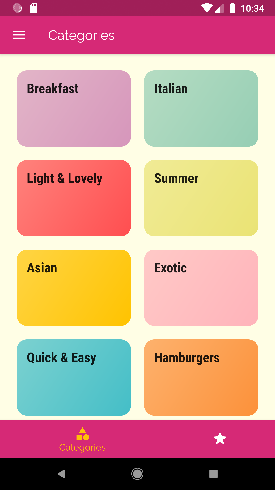
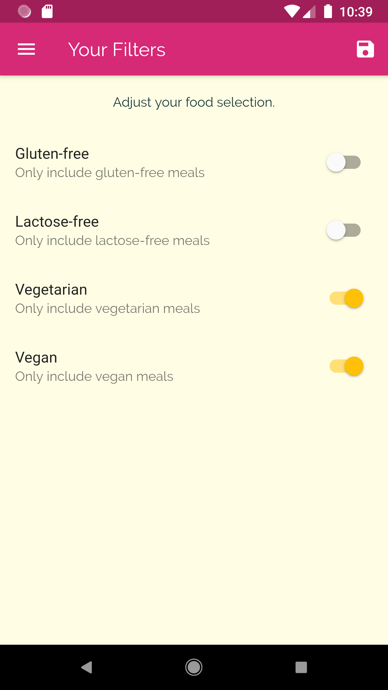
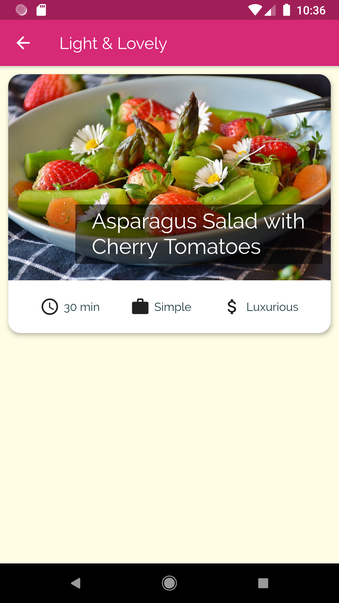
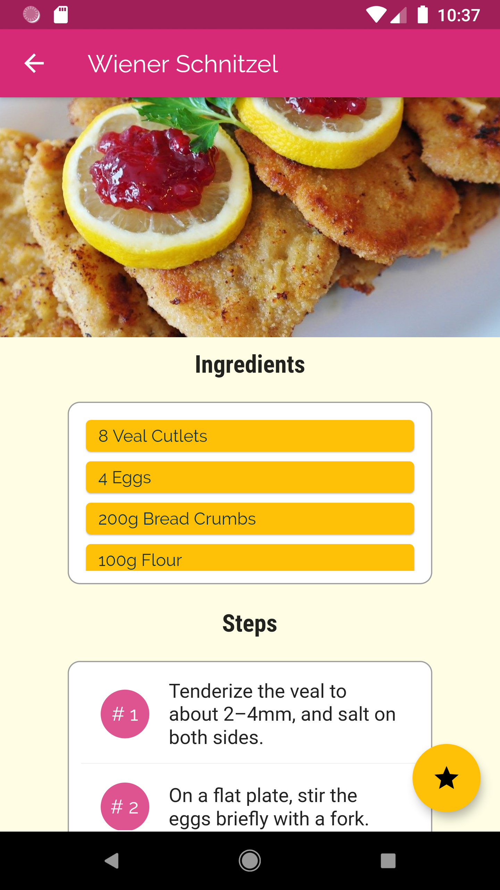
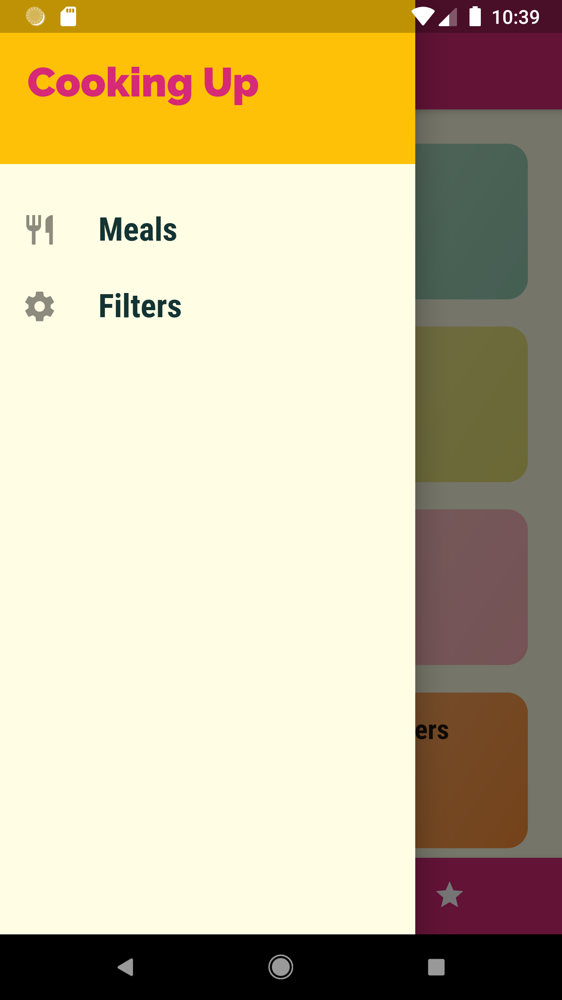

## 🍽️ Meal Planner App

A simple Flutter app that helps users explore meals, apply filters, and manage their favorite recipes.

## ✨ Features

Browse meals by category (Breakfast, Italian, Asian, Quick & Easy, etc.)

Mark meals as favorites and view them in a separate section

Apply dietary filters:

Gluten-free

Lactose-free

Vegetarian

Vegan

Clean and simple UI with colorful categories

## 🛠️ Tech Stack

Flutter (UI framework)

Dart (programming language)

## 📸 Screenshots

  
  
  

  
  
  

